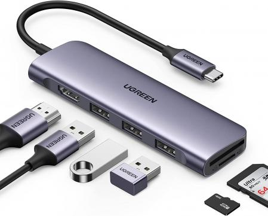
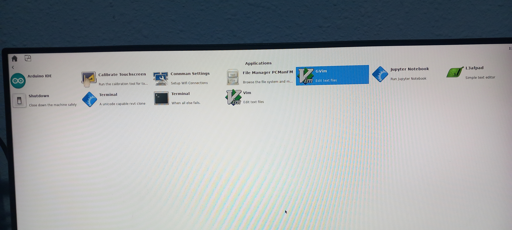

# In this folder there will be some stuff not directly refered to do a project or a script but still important to check out

# To activate the monitor for using the USB camera use this:
export DISPLAY=:0

# In the [WiFi](Errata+24001+U96+WiFi.pdf) file you can read that the boards built between workweek 45 of 2022 and workweek 23 of 2023 (our case) the WiFi module does not work.
# IMPORTANT: Before deepen yourself into using the board, is highly recommendend to do a brief read to the [HardWare-User-Guide](Ultra96-V2-HW-User-Guide-v1_3.pdf) & [Getting-Started-Guide](Ultra96-V2-GSG-v2_0.pdf) 

# In order to address the problem of not having enough ports to connect the monitor, a mouse, a keyboard, etc. we can use a hub:

## Before connecting the hub with a mouse and a keyboard connected the output of the command *lsusb* is what follows:
    Bus 002 Device 003: ID 0b95:1790 ASIX Electronics Corp. AX88179 Gigabit Ethernet
    Bus 002 Device 002: ID 0424:5744 Microchip Technology, Inc. (formerly SMSC) Hub
    Bus 002 Device 001: ID 1d6b:0003 Linux Foundation 3.0 root hub
    Bus 001 Device 003: ID 0424:2740 Microchip Technology, Inc. (formerly SMSC) Hub Controller
    Bus 001 Device 002: ID 0424:2744 Microchip Technology, Inc. (formerly SMSC) Hub
    Bus 001 Device 001: ID 1d6b:0002 Linux Foundation 2.0 root hub
    
## And after connecting it:
    Bus 002 Device 003: ID 0b95:1790 ASIX Electronics Corp. AX88179 Gigabit Ethernet
    Bus 002 Device 002: ID 0424:5744 Microchip Technology, Inc. (formerly SMSC) Hub
    Bus 002 Device 001: ID 1d6b:0003 Linux Foundation 3.0 root hub
    Bus 001 Device 003: ID 0424:2740 Microchip Technology, Inc. (formerly SMSC) Hub Controller
    Bus 001 Device 006: ID 1b1c:1b79 Corsair CORSAIR SABRE RGB PRO Gaming Mouse
    Bus 001 Device 005: ID 1a2c:4c5e China Resource Semico Co., Ltd USB Keyboard
    Bus 001 Device 004: ID 1a40:0101 Terminus Technology Inc. Hub
    Bus 001 Device 002: ID 0424:2744 Microchip Technology, Inc. (formerly SMSC) Hub
    Bus 001 Device 001: ID 1d6b:0002 Linux Foundation 2.0 root hub

## Once we load to Ultra we will get the following menu and we will be able to click and write in *GVim* for example:    

