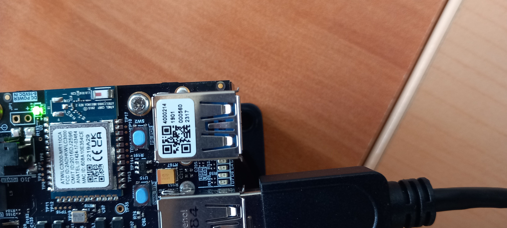
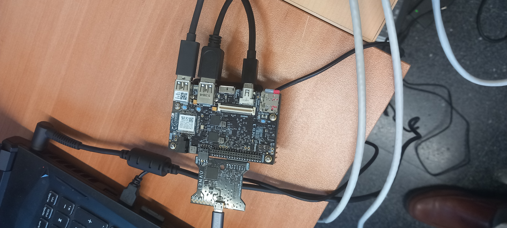
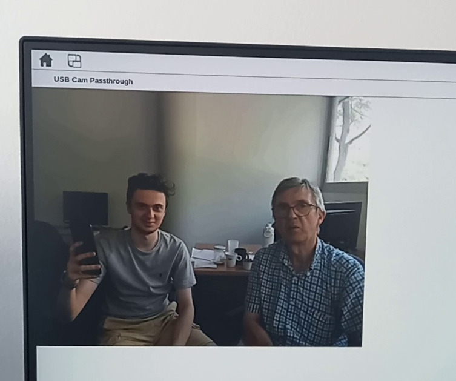
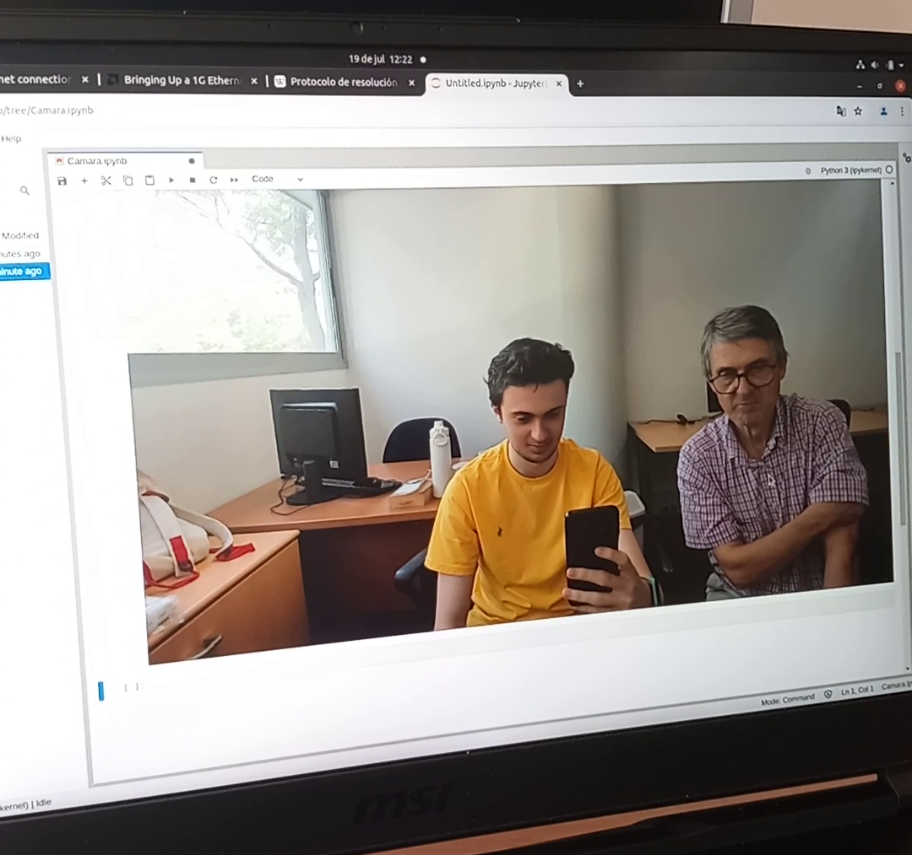
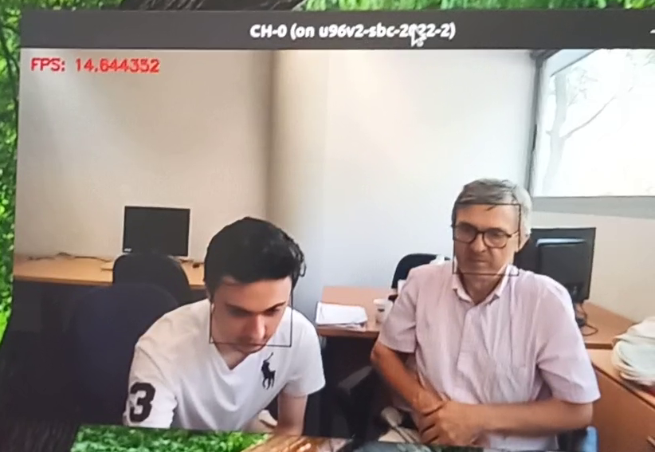
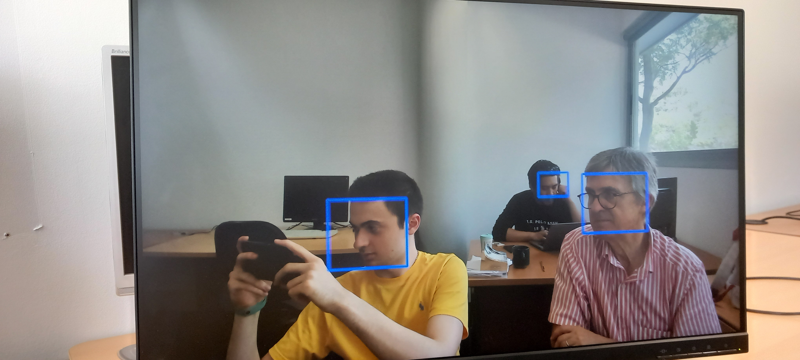
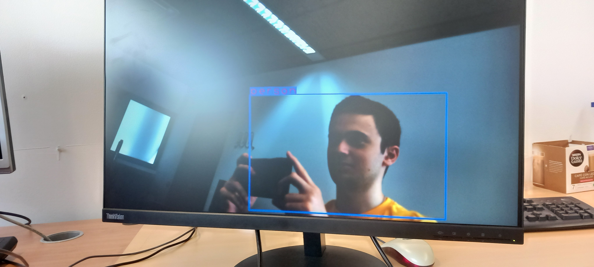

# In this folder you will find some images and videos showing the outputs of the work developed as well as important stuff
## Datecode of Ultra96-V2 (in our case 2317)(which means 17th week of 2023)

## Setup in order to use Ultra96-V2
### From bottom to top we can find on the right the Micro SD card, the black Mini DisplayPort - DisplayPort cable connected to the monitor, the grey USB cable used to connect Ethernet (using an adapter USB - Ethernet) & another grey cable to use the USB camera. On the left side there is the Pod with its Mini USB - USB cable connecting the Pod with the PC and finally it will be the cable of the power supply connected to circular connector, but in this case was disconnected.

## Once we have settled down the Ultra we can start working and executing some applications:
## USB camera from monitor
### These will be the outputs of following the steps of the [Ultra96-V2-Building_the_foundational_designs](../Projects/Ultra96-V2-Building_the_foundational_designs.sh)

## Using the USB camera from Python

## Once we have warmed up, we move on to the next step and we use the DPU of the Ultra96-V2: 
### This will be the output of following the proyect [Ultra96-V2-Adding_support_for_Vitis-AI_3.0](Ultra96-V2-Adding_support_for_Vitis-AI_3.0.sh)

## Due to the defective WiFi of the Ultra96-V2 we also used the KV260 for some applications:
## Facial recognition with KV260 
### This is one of the outputs of an application using KV260 which you can replicate following the steps showed at [Creating_a_Custom_Kria_App](../Projects/Creating_a_Custom_Kria_App.sh)

## Body recognition with minicamera KV260 
### Another application which not only can distinguish people but also vehicles

