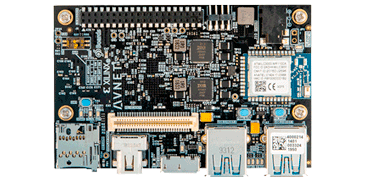
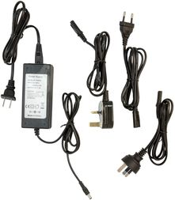
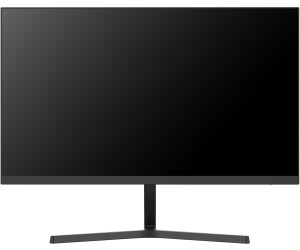
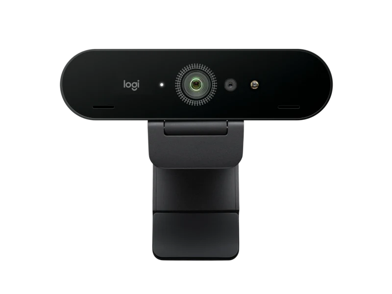
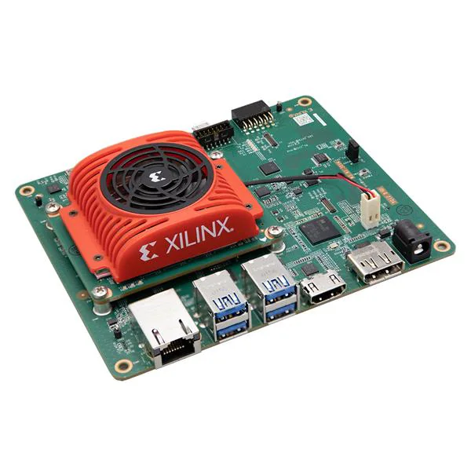
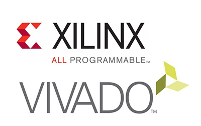

# CTTC-Internship
This repository will contain all the stuff that has been done during the stay in CTTC from the 3rd of July to the 16th of August 

## Hardware used

### Ultra96-V2

### AES-ACC-U96-4APWR

### Monitor with DisplayPort

### USB camera

### KV260

## Software

### Vivado

### Vitis

